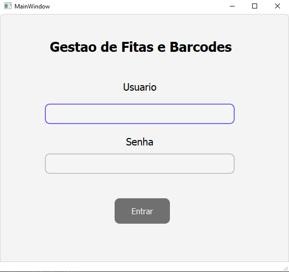
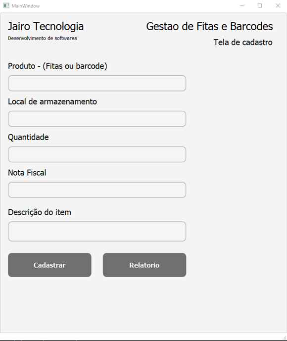

# Controle de Estoque de Fitas LTO e Barcodes

Este é um projeto desktop em Python para o gerenciamento de fitas LTO e barcodes de backup em um banco de dados MySQL. O projeto utiliza o PyQt5 para a interface gráfica e o PyMySQL para a interação com o banco de dados.

## Estrutura do Código
- Arquivo Principal: 
O código principal está no arquivo controle_bkp.py, que carrega as variáveis de ambiente e define a lógica da aplicação.

- Interfaces de Usuário:
formulario_bkp.ui: Interface para inserir novos produtos.
lista_bkp.ui: Interface para listar, editar e excluir produtos.
editar_bkp.ui: Interface para editar produtos existentes.
login.ui: Interface de login.

## Screenshots

## Requisitos

- `Python 3.7+`
- `PyQt5` para interface gráfica
- `pymysql` para a conexão com o banco de dados MySQL
- `python-dotenv` para carregar variáveis de ambiente a partir de um arquivo `.env`
-  Banco de dados MySQL com tabelas `produtos_bkp`
-  Variáveis de ambiente `DB_HOST`, `DB_USER`, `DB_PASSWORD` e `DB_DATABASE` definidas no arquivo `.env`
-  Cria um banco de dados MySQL com as tabelas `produtos_bkp` que contem com os campos `id`, `produto`, `armazenamento`, `estoque`, `nf`, `descricao`.
-  `bcrypt` para gerar e verificar hashes de senhas seguros.

## Configuração

1. Clone o repositório para o seu ambiente local:
   git clone https://github.com/seu-usuario/seu-repositorio.git

2. Instale as dependências necessárias:
   pip install -r requirements.txt

3. crie um banco de dados MySQL com as tabelas `produtos_bkp` que contem com os campos `id`, `produto`, `armazenamento`, `estoque`, `nf`, `descricao`.

    CREATE TABLE produtos_bkp (
        id INT NOT NULL AUTO_INCREMENT PRIMARY KEY,
        produto VARCHAR(255) NOT NULL,
        armazenamento VARCHAR(255) NOT NULL,
        estoque VARCHAR(255) NOT NULL,
        nf VARCHAR(255) NOT NULL,
        descricao VARCHAR(255) NOT NULL,
    );

3.1 Crie um banco de dados MySQL com as tabelas `usuarios` que contem com os campos `id`, `usuario` e `senha`.

    CREATE TABLE usuarios ( 
        id INT NOT NULL AUTO_INCREMENT PRIMARY KEY, 
        usuario VARCHAR(100) NOT NULL, 
        senha VARCHAR(255) NOT NULL 
    );

4. Crie um arquivo .env na raiz do projeto com as seguintes variáveis de ambiente:

    DB_HOST=seu_host
    DB_USER=seu_usuario
    DB_PASSWORD=sua_senha
    DB_DATABASE=seu_banco_de_dados

## Funcionalidades

Inserir Items
Na janela de formulário, o usuário insere os detalhes do produto (nome, local de armazenamento, estoque, nota fiscal, descrição) e clica no botão "Cadastrar". A função inserir() é chamada para salvar o novo produto no banco de dados.

Listar Items
O botão "Relatório" na janela de formulário exibe a lista de produtos cadastrados. A função lista() realiza uma consulta SQL para obter todos os produtos e exibi-los na tabela da interface.

Editar Items
Na janela de listagem, o botão "Alterar" abre a janela de edição para o produto selecionado. A função editar() carrega os dados atuais do produto nos campos de texto para edição, permitindo salvar alterações ao clicar no botão "Confirmar".

Excluir Items
Na janela de listagem, o botão "Deletar" permite excluir o produto selecionado da tabela e do banco de dados. A função excluir() remove a linha da tabela e executa uma consulta SQL para excluir o produto correspondente no banco.

## Contribuição
Se você deseja contribuir com o projeto, por favor, faça um fork do repositório e envie um pull request com suas alterações.

## Licença
Este projeto é licenciado sob a licença MIT.

## Contato
Se você tiver alguma dúvida ou precisar de ajuda, por favor, entre em contato comigo através do meu perfil do GitHub.

## Histórico de alterações
- Versão 1.0.0: Lançamento inicial
- Versão 1.1.0: Adição de recursos de edição e exclusão
- Versão 1.2.0: Correção de bugs e melhorias de desempenho
- Versão 1.3.0: Adição de interface de login e autenticação de usuários